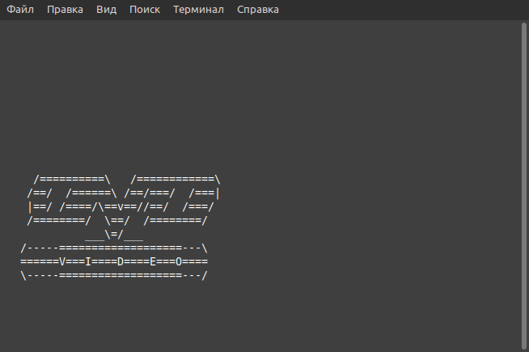

# COBOL DVD Thingy

This program is a terminal screensaver for Linux and similar systems that
displays a moving DVD logo similar to the ones you might see in a DVD player.

## How to build

Dependencies:

- GnuCOBOL - [https://gnucobol.sourceforge.io](https://gnucobol.sourceforge.io)

There is a `flake.nix` you can use with `nix develop` to generate a devlopment
environment

Then, run one of the following commands in the project directory:

```sh
./build.sh

# Build with optimizations
EXTRA_COBFLAGS='-O3' ./build.sh
```

The executable will be named `cobol-dvd-thingy`.

## Installation

You can install it with Nix from the NUR
[https://github.com/nix-community/NUR](https://github.com/nix-community/NUR)
with the following attribute:

```nix
nur.repos.ona-li-toki-e-jan-Epiphany-tawa-mi.cobol-dvd-thingy
```

## Release notes

- Relicensed as GPLv3+ (originally MIT.)
- Switched to using DISPLAY and ACCEPT for display.
- Simplified build system.
- Added command line arguments `-h`, `-v`, and `-l`.
